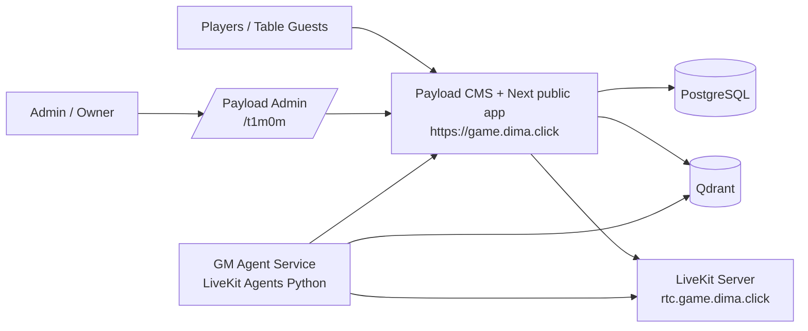

# Architecture Overview

The new GameMaster stack replaces the old custom web control plane with a framework-led split:

- Payload CMS owns admin auth, collections, globals, uploads, and APIs.
- A simple public frontend lives inside the same Next.js app for player join flow.
- LiveKit Agents runs the voice-first GM runtime as a separate Python service.
- Qdrant holds rulebook and supplement chunks for retrieval.
- PostgreSQL is the durable source of truth for collections, sessions, metadata, and policy.

## System diagram

## Boundary decisions

- The player UI is intentionally simple and public-facing.
- Admin configuration stays inside Payload instead of a second bespoke admin app.
- The agent runtime is a separate service so voice orchestration can evolve independently of the control plane.
- Retrieval remains in Qdrant rather than pushing vectors into Postgres.

## Initial migration scope

Kept from the old GM app:

- hidden admin route pattern
- campaign / session / ruleset concepts
- rulebook and supporting-book retrieval flow
- LiveKit room model
- Qdrant-backed document search
- admin-only advanced runtime controls

Replaced:

- custom React-heavy settings/admin system
- brittle mixed auth and callback logic
- custom control-plane API layer for admin/runtime policy

Deferred until cutover hardening:

- production LiveKit TURN/ICE tuning
- richer multiplayer transcript persistence
- full player account auth beyond guest-first room join
