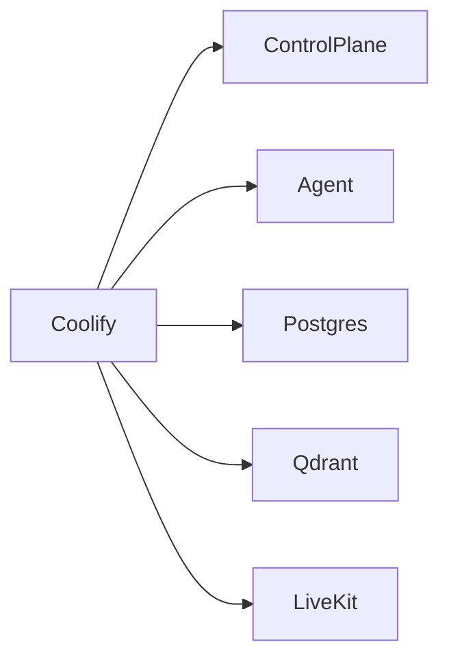

# Deployment Instructions

## Coolify topology

Deploy this repo as a new project, not as an overwrite of the old GM app.

Recommended application layout:

- `gm-control-plane`
- `gm-agent`
- `gm-postgres`
- `gm-qdrant`
- `gm-livekit`

## Public routes

- `https://game.dima.click` -> control-plane public frontend
- `https://game.dima.click/t1m0m` -> Payload admin
- `wss://rtc.game.dima.click` -> LiveKit signaling

## Compose flow

Use [`docker-compose.coolify.yml`](../docker-compose.coolify.yml) as the source of truth.

## Notes

- Payload is the only web app that needs the main `game.dima.click` domain.
- LiveKit should be exposed on a separate public subdomain such as `rtc.game.dima.click`.
- The control-plane container runs `payload migrate` on startup before launching the Next standalone server, so the tracked Postgres schema is applied automatically on deploy.
- The current compose uses LiveKit `--dev` mode for migration validation. Before cutover, replace that with hardened LiveKit server config, TURN, and ICE policy.
- Postgres and Qdrant should use persistent volumes in Coolify.

## Backup and restore

See [Backup and Restore Plan](./backup-and-restore.md) for the operational baseline before cutover.

## First admin bootstrap

1. Set `GM_BOOTSTRAP_ADMIN_EMAIL` and `GM_BOOTSTRAP_ADMIN_PASSWORD` in Coolify for the control-plane service.
2. Deploy or redeploy the control-plane service.
3. Confirm the startup bootstrap created the first admin, campaign, ruleset, session, runtime defaults, and seed documents.
4. Open `https://game.dima.click/t1m0m` and log in with the bootstrap admin.
5. Verify the public homepage lists the seeded session.
