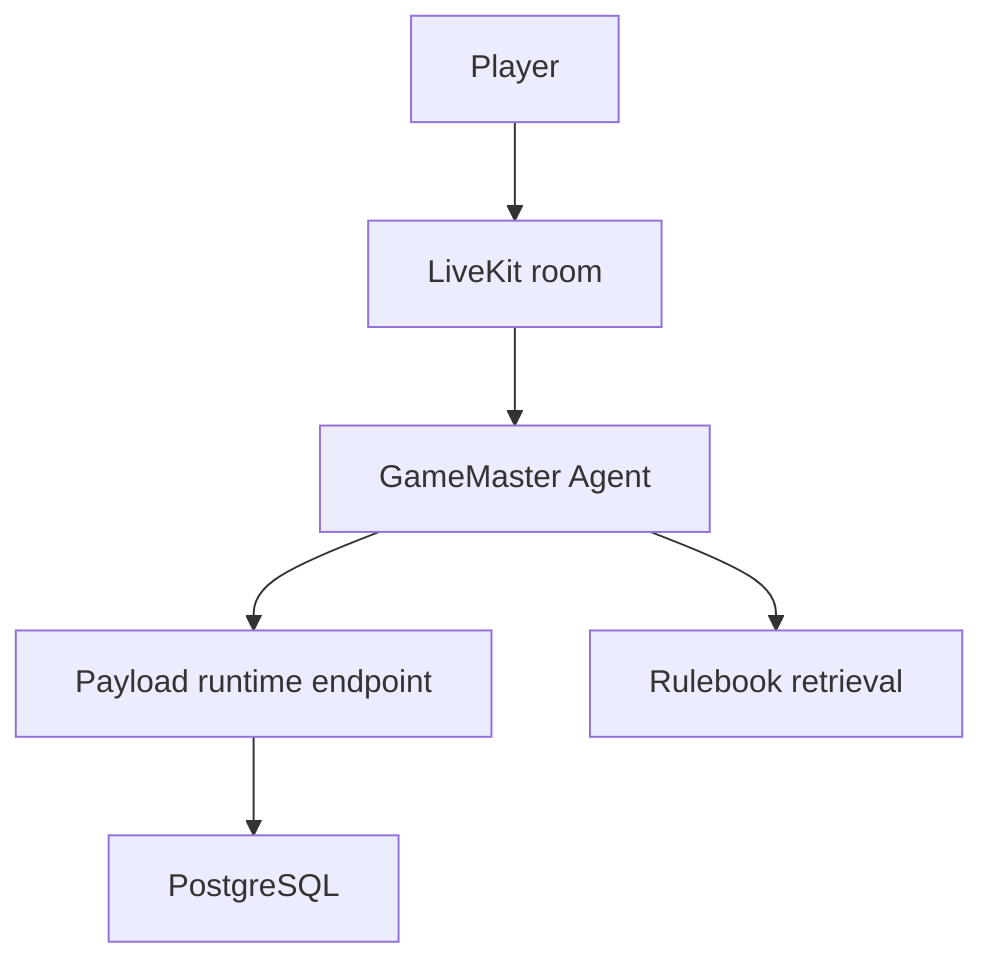

# LiveKit Runtime Model

## Why a separate agent service

Payload is the control plane. The actual voice-first GM should stay outside the CMS process.

## Runtime flow

1. Player opens a public session page.
2. The control plane mints a LiveKit token and ensures the room exists.
3. The browser joins the room.
4. The agent worker receives the room session.
5. The agent asks Payload for runtime defaults and active documents.
6. On rules/lore questions, the agent calls the retrieval endpoint-backed tool.
7. Responses are spoken with the configured TTS provider.

## Current provider baseline

- LLM: Gemini by default
- STT: Deepgram `nova-3`
- TTS: Deepgram `aura-2`
- Voice mode: Auto VAD primary

## Hardening still needed before cutover

- production LiveKit config instead of `--dev`
- TURN/ICE hardening for browsers on real networks
- richer transcript persistence back into the control plane
