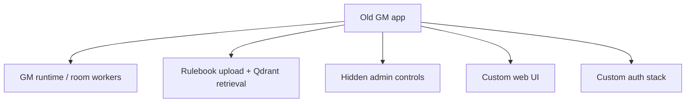

# Migration Plan From `GMv3-open`

## Source system inventory

The old stack in `GMv3-open` and the local `GameMaster_Transfer_Clean` repo contributed the domain model, but not the new shell:

## Migration map

| Old concept | New home | Migration choice |
|---|---|---|
| hidden admin route `/t1m0m` | Payload admin route | keep |
| room-worker model | LiveKit Agents Python worker | keep concept, replace implementation |
| rulebook/supporting-book upload | Payload `documents` collection + upload | simplify and keep |
| Qdrant retrieval | shared Qdrant collection strategy | keep |
| advanced runtime tuning | Payload globals and admin collections | replace custom UI |
| user settings shell | simple public frontend | replace |
| mixed auth/frontend complexity | Payload admin auth + guest player join | replace |

## Phases

1. Foundation
   - Payload + Postgres + Qdrant + LiveKit + agent service
2. Domain model
   - campaigns, worlds, rulesets, sessions, documents, runtime defaults
3. Voice runtime
   - LiveKit Agents worker with rulebook retrieval tool
4. Public player shell
   - session browser + room join
5. Hardening
   - deployment, DNS, TLS, room validation, cutover checklist

## What is intentionally not copied over

- old studio/settings UX
- old callback-heavy auth flow
- ad-hoc frontend admin panels
- duplicate settings layers that were drifting out of sync
