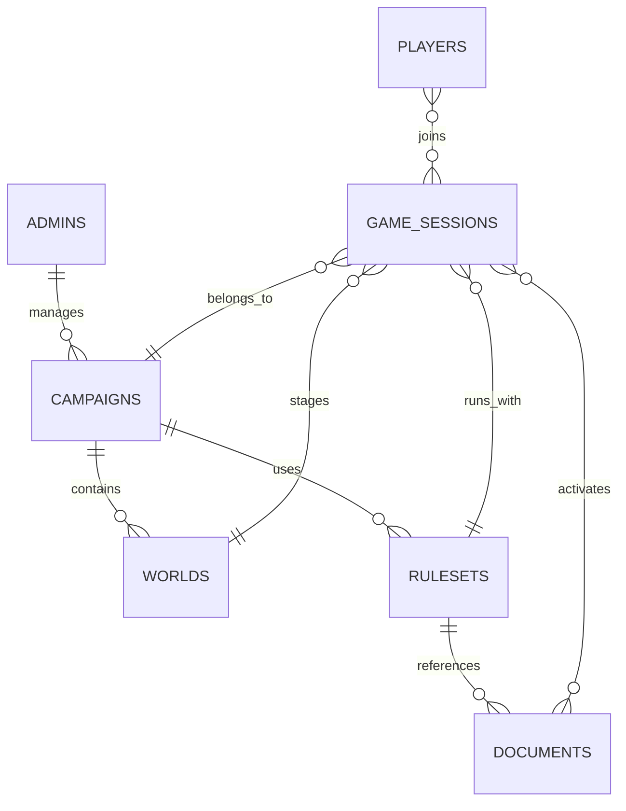

# Payload Collection Model

## Collections

## Core records

- `admins`
  - Payload auth collection
  - owner/operator roles
- `players`
  - lightweight player identity records for session join
- `campaigns`
  - long-running game arcs
- `worlds`
  - setting-level metadata and tone
- `rulesets`
  - main rules package grouping
- `documents`
  - uploaded rulebooks and supplements with ingest status
- `game-sessions`
  - room metadata and public join configuration
- `provider-connections`
  - provider metadata and model defaults visible only to admins

## Globals

- `runtime-defaults`
  - provider defaults
  - VAD-first voice settings
  - system prompt
  - retrieval policy
- `site-settings`
  - public homepage copy and labels

## Access model

- admin collections and globals: admin session required
- public join flow: custom endpoint only
- runtime context + retrieval: internal token only
