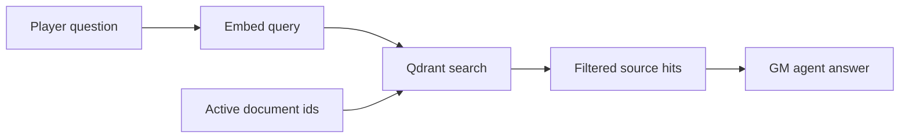

# Qdrant Strategy

The new stack keeps Qdrant as the dedicated retrieval engine. PostgreSQL remains relational only.

## Collection strategy

- collection name: `gm_rulebook_chunks`
- vector size: determined by the configured embedding model, currently `text-embedding-3-small`
- distance: cosine

## Chunk payload

Each point stores:

- `doc_id`
- `title`
- `content`
- `chunk_index`
- `doc_kind`
- `ruleset_id`
- `session_id`
- `is_primary`
- `is_active`

## Filter strategy

The runtime filters primarily on:

- active document IDs for the session
- ruleset and session scope where useful
- `is_active = true`

## Payload indexes

Payload indexes are created for:

- `doc_id`
- `ruleset_id`
- `session_id`
- `doc_kind`
- `is_active`
- `is_primary`

These keep the session-level retrieval path cheap and explicit.
